# Better Auth Testing Map

This diagram shows the existing test structure and where new identifier-table tests would fit.

```mermaid
classDiagram
    class TestStructure {
        Core Tests
    }
    
    class CoreTests {
        init.test.ts
        db.test.ts
        internal-adapter.test.ts
    }
    
    class APITests {
        call.test.ts
        to-auth-endpoints.test.ts
        routes/*
    }
    
    class AdapterTests {
        test.ts (base test suite)
        memory-adapter/adapter.memory.test.ts
        drizzle-adapter/test/*.test.ts
        kysely-adapter/test/**/*.test.ts
        mongodb-adapter/adapter.mongo-db.test.ts
        prisma-adapter/test/**/*.test.ts
    }
    
    class PluginTests {
        plugin-name/plugin-name.test.ts
    }
    
    class UtilityTests {
        client/client.test.ts
        client/url.test.ts
        cookies/cookies.test.ts
        crypto/password.test.ts
        logger.test.ts
    }
    
    class ProposedTests {
        <<Proposed>>
        db/identifier-table.test.ts
        adapters/test/identifier-table-tests.ts
        adapters/*-adapter/test/adapter.identifier-table.test.ts
    }
    
    TestStructure --> CoreTests
    TestStructure --> APITests
    TestStructure --> AdapterTests
    TestStructure --> PluginTests
    TestStructure --> UtilityTests
    TestStructure --> ProposedTests
    
    APITests -- routes
    routes : sign-in.test.ts
    routes : sign-up.test.ts
    routes : sign-out.test.ts
    routes : session-api.test.ts
    routes : account.test.ts
    routes : email-verification.test.ts
    routes : forget-password.test.ts
    routes : update-user.test.ts
    
    AdapterTests -- adapters
    adapters : Memory Adapter
    adapters : Drizzle Adapter
    adapters : Kysely Adapter
    adapters : MongoDB Adapter
    adapters : Prisma Adapter
    
    PluginTests -- plugins
    plugins : access.test.ts
    plugins : additional-fields.test.ts
    plugins : admin.test.ts
    plugins : anon.test.ts
    plugins : api-key.test.ts
    plugins : bearer.test.ts
    plugins : captcha.test.ts
    plugins : custom-session.test.ts
    plugins : email-otp.test.ts
    plugins : generic-oauth.test.ts
    plugins : haveibeenpwned.test.ts
    plugins : jwt.test.ts
    plugins : magic-link.test.ts
    plugins : multi-session.test.ts
    plugins : oauth-proxy.test.ts
    plugins : oidc.test.ts
    plugins : one-time-token.test.ts
    plugins : open-api.test.ts
    plugins : organization.test.ts
    plugins : passkey.test.ts
    plugins : phone-number.test.ts
    plugins : sso.test.ts
    plugins : team.test.ts
    plugins : two-factor.test.ts
    plugins : username.test.ts
    
    class CoreIdentifierTests {
        <<Proposed>>
        Test core identifier-table functionality
        Test schema generation
        Test DB model operations
    }
    
    class AdapterIdentifierTests {
        <<Proposed>>
        Test adapter interface with identifier table
        Test CRUD operations for identifiers
        Test relation between users and identifiers
    }
    
    class IntegrationIdentifierTests {
        <<Proposed>>
        Test authentication flow with identifiers
        Test sign-in with different identifier types
        Test linking/unlinking identifiers
    }
    
    class SecurityValidationTests {
        <<Proposed>>
        Test identifier validation and sanitization
        Test for preventing identifier enumeration
        Test identifier-based rate limiting
    }
    
    class ErrorHandlingTests {
        <<Proposed>>
        Test for duplicate identifiers
        Test for invalid identifiers
        Test conflict resolution
    }
    
    class PluginIdentifierTests {
        <<Proposed>>
        Test magic-link with different identifier types
        Test 2FA with different identifiers
        Test email verification with non-email identifiers
    }
    
    class MigrationTests {
        <<Proposed>>
        Test migration from email-only to multi-identifier
        Test backward compatibility
    }
    
    class APIIdentifierTests {
        <<Proposed>>
        Test API endpoints for managing identifiers
        Test identifier-specific error responses
    }
    
    ProposedTests --> CoreIdentifierTests
    ProposedTests --> AdapterIdentifierTests
    ProposedTests --> IntegrationIdentifierTests
    ProposedTests --> SecurityValidationTests
    ProposedTests --> ErrorHandlingTests
    ProposedTests --> PluginIdentifierTests
    ProposedTests --> MigrationTests
    ProposedTests --> APIIdentifierTests
```

## Test Structure Explanation

The diagram maps both existing test files and proposed new test files for the identifier table feature:

### Existing Test Structure
- **Core Tests**: Basic functionality tests for initialization, database operations, and internal adapter functionality
- **API Tests**: Tests for API calls, endpoints, and routes like sign-in, sign-up, etc.
- **Adapter Tests**: Tests for different database adapters (Memory, Drizzle, Kysely, MongoDB, Prisma)
- **Plugin Tests**: Tests for various authentication plugins (2FA, admin, anonymous, etc.)
- **Utility Tests**: Tests for utility functions like client operations, cookies, crypto

### Proposed Identifier Table Tests
- **Core Identifier Tests**: Test core functionality of the identifier table, schema generation, and database model operations
- **Adapter Identifier Tests**: Test how each adapter interfaces with the identifier table, including CRUD operations
- **Integration Identifier Tests**: End-to-end tests of authentication flows using different identifier types
- **Security and Validation Tests**: Tests for identifier validation, preventing enumeration attacks, and rate limiting
- **Error Handling Tests**: Tests for duplicate identifiers, invalid identifiers, and conflict resolution
- **Plugin Identifier Tests**: Tests for how plugins interact with different identifier types
- **Migration Tests**: Tests for migrating from email-only to multi-identifier systems and backward compatibility
- **API Identifier Tests**: Tests for API endpoints that manage identifiers and their error responses

This structure allows for comprehensive testing of the new identifier table feature while maintaining separation from existing tests to avoid breakage.

## Additional Considerations

Based on analysis of the existing test patterns in the codebase, some categories of tests were omitted from the diagram:

1. **Performance Tests**: While important, the codebase doesn't currently include performance benchmarking or load testing
2. **Concurrent Operations Tests**: The existing tests focus on sequential operations rather than parallel execution
3. **Cleanup and Lifecycle Tests**: These are partially covered in existing tests but not as a distinct category

These could be considered for future test expansion if they become higher priority.